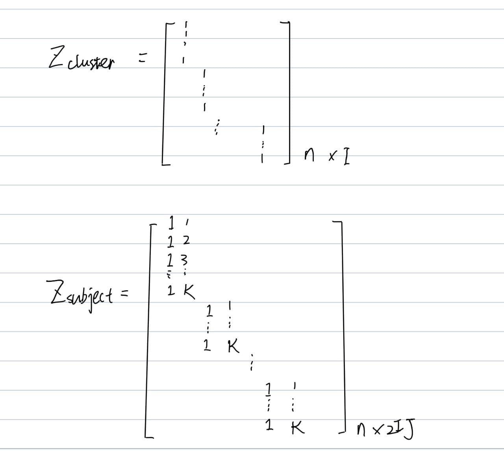

# Cross-Validation for Correlated Data Paper Summary

### Linear Mixed Model

$$
y_{i, j}=\phi_{i, j}^{t} \boldsymbol{\beta}+b_{i}+\epsilon_{i, j}, i \in\{1, \ldots, I\}, j \in\left\{1, \ldots, n_{i}\right\}
$$
where $y_{i, j} \in \mathbb{R}$ is the $j^{t h}$ observation for cluster $i, \phi_{i, j} \in \mathbb{R}^{p}$ are the observed fixed effects covariates, $\boldsymbol{\beta} \in \mathbb{R}^{p}$ is the fixed effects coefficients vector, $b_{i} \sim N\left(0, \sigma_{b}^{2}\right)$ are independent random effects and $\epsilon_{i, j} \sim N\left(0, \sigma_{\epsilon}^{2}\right)$ are the i.i.d. errors. Since all the observations in cluster $i$ share the same random effect realization, they are correlated. 

### Cross-Validation 

 $T$ , whole data set, is randomly partitioned into $\mathrm{K}$ folds, $T_{1}=\left\{y_{i}, \boldsymbol{x}_{i}\right\}_{i=1}^{n_{1}}$

$T_{2}=\left\{y_{i}, \boldsymbol{x}_{i}\right\}_{i=\left(n_{1}+1\right)}^{n_{2}}, \ldots, T_{K}=\left\{y_{i}, \boldsymbol{x}_{i}\right\}_{i=\left(n_{K-1}+1\right)}^{n_{K}},{ }^{1}$ where $n_{k}-n_{k-1}$ is the sample size in fold $k$ and $n_{K}=n$. 

For each $k \in\{1, \ldots, K\}$, the model is trained on the entire data except the $k^{\text {th }}$ fold, denoted by $T_{-k}=\bigcup_{j \neq k} T_{j}=\left\{\boldsymbol{y}_{-k}, X_{-k}\right\}$. The prediction error of the trained model is then measured on the holdout fold, $T_{k}=\left\{\boldsymbol{y}_{k}, X_{k}\right\}$, with respect to some loss function $L(\cdot, \cdot)$ : $\mathbb{R} \times \mathbb{R} \rightarrow \mathbb{R}$. 

The CV prediction error estimator ,
$$
C V=\frac{1}{n} \sum_{k=1}^{K} \sum_{i \in k^{t h} f o l d} L\left(y_{i}, \hat{y}\left(\boldsymbol{x}_{i} ; T_{-k}\right)\right)
$$
where $\hat{y}\left(\boldsymbol{x}_{i} ; T_{-k}\right)$ is the predictor of $y_{i}$, constructed by training with $T_{-K}$ and predicting on $\boldsymbol{x}_{i}$. 

Leave one out $K=n$.

### Generalization Error

$$
\text{generalization error}=\mathbb{E}_{T_{t e}, T_{t r}} \frac{1}{n_{t e}} \sum_{i=1}^{n_{t e}} L\left(y_{t e, i}, \hat{y}\left(\boldsymbol{x}_{t e, i} ; T_{t r}\right)\right)
where
$$

- $T_{t r}=\left\{\boldsymbol{y}_{t r}, X_{t r}\right\}=\left\{y_{t r, i}, \boldsymbol{x}_{t r, i}\right\}_{i=1}^{n_{t r}}$
$-\boldsymbol{x}_{t r, i}$ is an i.i.d. sample from $P_{\boldsymbol{x}}$
$-y_{t r, i}$ is sampled from $P_{y \mid x=x_{t r, i}, s=s_{0}}$
- $T_{t e}=\left\{\boldsymbol{y}_{t e}, X_{t e}\right\}=\left\{y_{t e, i}, \boldsymbol{x}_{t e, i}\right\}_{i=1}^{n_{t e}}$
$-\boldsymbol{x}_{t e, i}$ is an i.i.d. sample from $P_{\boldsymbol{x}}$
$-y_{t e, i}$ is sampled from $P_{y \mid x=x_{t e, i}, s=s_{t e}}$

Cross-validation is an estimator of generalization error.

### General Formulation of CV Bias

$$
\begin{align}
w_{c v}&=\text{generalization error} - \text{cross-validation error}\\
& =\mathbb{E}_{T_{t e}, T_{t r}}\left(y_{t e}-\hat{y}\left(\boldsymbol{x}_{t e} ; T_{t r}\right)\right)^{2}
-\frac{1}{n} \mathbb{E}_{T}\left\|\boldsymbol{y}-\hat{\boldsymbol{y}}_{c v}(T)\right\|^{2},
\end{align}
$$
where $\hat{\boldsymbol{y}}_{c v}(T)=\left(\hat{y}\left(\boldsymbol{x}_{1} ; T_{-1}\right), \ldots, \hat{y}\left(\boldsymbol{x}_{n} ; T_{-n}\right)\right)^{t}$ is the CV predictor of $\boldsymbol{y}$. An unbiased estimator of the generalization error is:
$$
C V_{c}=C V+w_{c v} .
$$

### Criterion for CV Unbiasedness

Let $P_{T_{t e}, T_{t r}}$ and $P_{T_{k}, T_{-k}}$ be the joint distributions of $\left\{T_{t e}, T_{t r}\right\}$ and $\left\{T_{k}, T_{-k}\right\}$, respectively. Theorem $2.1$ describes a simple generic condition when no correction is required for CV.

**Theorem 2.1.** If  $P_{T_{t e}, T_{t r}}=P_{T_{k}, T_{-k}} \forall k \in\{1, . ., n\} \text {, then } w_{c v}=0$.

### Unbiased LMM Case

Training set and test set have the same random effect realization i.e. $\boldsymbol{s}_{t e}=\boldsymbol{s}_{0}$, i.e.,
$$
\begin{aligned}
\boldsymbol{y} &=\Phi \boldsymbol{\beta}+Z \boldsymbol{s}_{0}+\boldsymbol{\epsilon} \\
\boldsymbol{y}_{t r} &=\Phi_{t r} \boldsymbol{\beta}+Z_{t r} \boldsymbol{s}_{0}+\boldsymbol{\epsilon}_{t r} \\
y_{t e} &=\boldsymbol{\phi}_{t e} \boldsymbol{\beta}+\boldsymbol{z}_{t e} \boldsymbol{s}_{0}+\epsilon_{t e}
\end{aligned}
$$
and
$$
\begin{aligned}
X &=\{\Phi, Z\}, \Phi \in \mathbb{R}^{n \times(p-q)}, Z \in \mathbb{R}^{n \times q} \\
X_{t r} &=\left\{\Phi_{t r}, Z_{t r}\right\}, \Phi_{t r} \in \mathbb{R}^{(n-1) \times(p-q)}, Z_{t r} \in \mathbb{R}^{(n-1) \times q} \\
\boldsymbol{x}_{t e} &=\left\{\phi_{t e}, \boldsymbol{z}_{t e}\right\}, \phi_{t e} \in \mathbb{R}^{1 \times(p-q)}, \boldsymbol{z}_{t e} \in \mathbb{R}^{1 \times q},
\end{aligned}
$$

### Biased LMM Case

When **test set has new realization of random effect**,
$$
\begin{aligned}
\boldsymbol{y} &=\Phi \boldsymbol{\beta}+Z \boldsymbol{s}_{0}+\boldsymbol{\epsilon} \\
\boldsymbol{y}_{t r} &=\Phi_{t r} \boldsymbol{\beta}+Z_{t r} \boldsymbol{s}_{0}+\boldsymbol{\epsilon}_{t r} \\
y_{t e} &=\boldsymbol{\phi}_{t e} \boldsymbol{\beta}+\boldsymbol{z}_{t e} \boldsymbol{s}_{te}+\epsilon_{t e}
\end{aligned}
$$

### Definition of H

**Definition 2.1**. $\hat{\boldsymbol{y}}_{c v}(T)$ is linear in $\boldsymbol{y}$ if:
$$
\hat{\boldsymbol{y}}_{c v}(T)=H_{c v} \boldsymbol{y}
$$
where $H_{c v} \in \mathbb{R}^{n \times n}$ does not contain $\boldsymbol{y}$ and is constructed as follows:
$$
H_{c v}=\left[\begin{array}{cccc}
0 & h_{1,2} & \ldots & h_{1, n} \\
h_{2,1} & 0 & & h_{2, n} \\
\ldots & & & \\
h_{n, 1} & h_{n, 2} & \ldots & 0
\end{array}\right]
$$
$h_{k, k^{\prime}} \in \mathbb{R} \forall k, k^{\prime} \in\{1, \ldots, n\}$

**Definition 2.2.** Let $\boldsymbol{h}_{t e} \in \mathbb{R}^{1 \times n-1}$ be the hat vector of $y_{t e}$, constructed from $\left\{X_{t r}, \operatorname{Cov}\left(y_{t e}, \boldsymbol{y}_{t r}\right)\right\}$ in the same way as $\boldsymbol{h}_{k}$ is constructed from $\left\{X_{-k}, \operatorname{Cov}\left(y_{k}, \boldsymbol{y}_{-k}\right)\right\}$.

**Theorem 2.2.** Let $\hat{\boldsymbol{y}}_{c v}(T)=H_{c v} \boldsymbol{y}$ be a linear predictor of $\boldsymbol{y}$, and $\hat{y}_{t e}\left(\boldsymbol{x}_{t e}, T_{t r}\right)=\boldsymbol{h}_{t e} \boldsymbol{y}_{t r}$ is its corresponding predictor of $y_{t e}$. Then:
$$
w_{c v}=\frac{2}{n} \mathbb{E}\left[\operatorname{tr}\left(H_{c v} \operatorname{Cov}(\boldsymbol{y}, \boldsymbol{y})\right)-n \boldsymbol{h}_{t e} \operatorname{Cov}\left(\boldsymbol{y}_{t r}, y_{t e}\right)\right] .
$$

### Estimator of Generalization Error 

Using Theorem 2.2, given $\operatorname{Cov}(\boldsymbol{y}, \boldsymbol{y})$ and $\operatorname{Cov}\left(\boldsymbol{y}_{\text {tr }}, y_{\text {te }}\right)$, an estimator of the generalization error for a linear predictor is:
$$
\widehat{C V}_{c}=\frac{1}{n}\left(\boldsymbol{y}-H_{c v} \boldsymbol{y}\right)^{t}\left(\boldsymbol{y}-H_{c v} \boldsymbol{y}\right)+\frac{2}{n}\left[\operatorname{tr}\left(H_{c v} \operatorname{Cov}(\boldsymbol{y}, \boldsymbol{y})\right)-n \boldsymbol{h}_{t e} \operatorname{Cov}\left(\boldsymbol{y}_{t r}, y_{t e}\right)\right]
$$

A special case is when $\operatorname{Cov}\left(\boldsymbol{y}_{t r}, y_{t e}\right)=0 .$ For example, in the clustered LMM setting that was given in Eq. (9), $\operatorname{Cov}\left(\boldsymbol{y}_{t r}, y_{t e}\right)=0$ when the latent variable realizations of $\boldsymbol{y}_{t r}$ and $y_{t e}$, i.e., $s_{0}$ and $s_{t e}$, are independent. In this case:
$$
\widehat{C V}_{c}=\frac{1}{n}\left(\boldsymbol{y}-H_{c v} \boldsymbol{y}\right)^{t}\left(\boldsymbol{y}-H_{c v} \boldsymbol{y}\right)+\frac{2}{n} \operatorname{tr}\left[H_{c v} \operatorname{Cov}(\boldsymbol{y}, \boldsymbol{y})\right]
$$

### Specifying $\boldsymbol{h_{te}}$ and $\operatorname{Cov}(\boldsymbol{y_{tr}}, {y})$ in a hierarchical clustering

structure:
$$
\begin{gathered}
y_{i, j, r}=\boldsymbol{x}_{i, j, r}^{t} \boldsymbol{\beta}+u_{i}+b_{i, j}+\epsilon_{i, j, r}, \\
u_{i} \sim N\left(0, \sigma_{u}^{2}\right), b_{i, j} \sim N\left(0, \sigma_{b}^{2}\right), \epsilon_{i, j, r} \sim N\left(0, \sigma_{\epsilon}^{2}\right), \\
\forall i \in\{1, \ldots, I\}, j \in\{1, \ldots, J\}, r \in\{1, \ldots, R\} .
\end{gathered}
$$
Assume that the prediction goal is to estimate:
$$
y_{t e}=\boldsymbol{x}_{t e}^{t} \boldsymbol{\beta}+u_{t e}+b_{t e}+\epsilon_{t e},
$$
where $u_{t e} \in\left[u_{1}, \ldots, u_{I}\right]$, however $b_{t e}$ does not depend on the realizations of $\left\{b_{i, j}\right\}_{i \in\{1, \ldots I\}, j \in\{1, \ldots, J\}}$.

Prediction goal is relates to one of the high-level clusters but from a new low-level cluster.

- Since $\boldsymbol{h}_{t e}$ is distributed as $\boldsymbol{h}_{k}$ (for random k), then $\boldsymbol{h}_{t e}$ can be extracted by selecting a random $\boldsymbol{h}_{k}$ from 

- $H_{c v} . \operatorname{Cov}\left(\boldsymbol{y}_{t r}, y_{t e}\right)$ is extracted correspondingly as $\operatorname{Cov}\left(\boldsymbol{y}_{-k}, y_{k} \mid \boldsymbol{b}, \boldsymbol{\epsilon}\right)$, where $\boldsymbol{b}$ and $\boldsymbol{\epsilon}$ are vectors containing $\left\{b_{i, j}\right\}_{i \in\{1, \ldots I\}, j \in\{1, \ldots, J\}}$ and $\left\{\epsilon_{i, j, r}\right\}_{i \in\{1, \ldots I\}, j \in\{1, \ldots, J\}, r \in\{1, \ldots, R\}}$, respectively. 
- By conditioning on these vectors, the remaining covariance stems from $\boldsymbol{u}=\left[u_{1}, \ldots, u_{I}\right]$ only, corresponding to the covariance between $\boldsymbol{y}_{t r}$ and $y_{t e}$.
- Simpler, $n \boldsymbol{h}_{t e} \operatorname{Cov}\left(\boldsymbol{y}_{t r}, y_{t e}\right)$ can be replaced by $\operatorname{tr}\left(H_{c v} \operatorname{Cov}(\boldsymbol{y}, \boldsymbol{y} \mid \boldsymbol{b}, \boldsymbol{\epsilon})\right)$, such that:

$$
\begin{aligned}
\widehat{C V}_{c} &=\frac{1}{n}\left(\boldsymbol{y}-H_{c v} \boldsymbol{y}\right)^{t}\left(\boldsymbol{y}-H_{c v} \boldsymbol{y}\right)+\frac{2}{n}\left[\operatorname{tr}\left(H_{c v} \operatorname{Cov}(\boldsymbol{y}, \boldsymbol{y})\right)-\operatorname{tr}\left(H_{c v} \operatorname{Cov}(\boldsymbol{y}, \boldsymbol{y} \mid \boldsymbol{b}, \boldsymbol{\epsilon})\right)\right] \\
&=\frac{1}{n}\left(\boldsymbol{y}-H_{c v} \boldsymbol{y}\right)^{t}\left(\boldsymbol{y}-H_{c v} \boldsymbol{y}\right)+\frac{2}{n} \operatorname{tr}\left(H_{c v} \operatorname{Cov}(\boldsymbol{y}, \boldsymbol{y} \mid \boldsymbol{u})\right) 
\end{aligned}
$$

## Simulation

The dependent variable, $\boldsymbol{y} \in \mathbb{R}^{n}$, was sampled from the following model:
$$
\begin{gathered}
y_{i, j, k}=0.1 \sum_{r=1}^{9} x_{i, j, k, r}+u_{i}+\sum_{r=1}^{2} z_{i, j, k, r} b_{i, j, r}+\epsilon_{i, j, k}, \\
i \in\{1, \ldots, I\}, j \in\{1, \ldots, 5\}, k \in\{1, \ldots, 10\},
\end{gathered}
$$
where

**Training Set:**

- the **random effects**: 
  - Clusters: $u_{i}$,
  - Subject:  $ \boldsymbol{b}_{i, j}=\left[b_{1}, b_{2}\right]$ and $\epsilon_{i, j, k}$ are independent and distributed as follows:
  - Time: for each k
$$
u_{i} \stackrel{i n d}{\sim} N\left(0,3^{2}\right), \boldsymbol{b}_{i, j}=\left[b_{i, j, 1}, b_{i, j, 2}\right] \in \mathbb{R}^{2} \stackrel{i n d}{\sim} N\left(0,\left[\begin{array}{cc}
3^{2} & 0 \\
0 & 1
\end{array}\right]\right), \epsilon_{i, j, k} \stackrel{i n d}{\sim} N(0,1)
$$
- the **covariates**, $\left\{\boldsymbol{x}_{r}\right\}_{r=1}^{9}$ are:
  - $x_{i, j, k, 1}=1, x_{i, j, k, 2}=k, \forall i, j, k$ are the intercept and the time covariates,
  - $x_{i, j, k, r}=\eta_{i}+\delta_{i, j, k}, \forall i, j, k$ and $\forall r \in\{3, \ldots, 9\}$, where $\eta_{i} \stackrel{i n d}{\sim} N(0,1), \delta_{i, j, k} \stackrel{i n d}{\sim}$ $N(0,1)$ are independent,
- $z_{i, j, k, 1}=1, z_{i, j, k, 2}=k \  \forall i, j, k$ are the covariates for random intercept and random slope.

**Test Set with different cluster:**
$$
\begin{gathered}
y_{i, j, k \text{ te}}=0.1 \sum_{r=1}^{9} x_{i, j, k, r\text{ te}}+u_{i\text{ te}}+\sum_{r=1}^{2} z_{i, j, k, r} b_{i, j, r \text{ te}}+\epsilon_{i, j, k}, \\
i \in\{1, \ldots, I\}, j \in\{1, \ldots, 5\}, k \in\{1, \ldots, 10\},
\end{gathered}
$$
Generate the whole data set by using new realization of every random effect.

**Test set with same cluster:**
$$
\begin{gathered}
y_{i, j, k \text{ te}}=0.1 \sum_{r=1}^{9} x_{i, j, k, r\text{ te}}+u_{i\text{ }}+\sum_{r=1}^{2} z_{i, j, k, r} b_{i, j, r \text{ te}}+\epsilon_{i, j, k}, \\
i \in\{1, \ldots, I\}, j \in\{1, \ldots, 5\}, k \in\{1, \ldots, 10\},
\end{gathered}
$$
Using the same cluster random effect realization $u_i$.

### Cross-validation error

$Z_\text{cluster}$ and $Z_\text{subject}$ are defined as in the picture

### Simulation Procedure

let $n = I\times J\times K$

##### 1. Get the variance matrix

$\sigma_\text{cluster} = 1, \sigma_\text{subject1} = 1, \sigma_\text{subject2}=3, \sigma_\epsilon = 1$

$V_\text{cluster} = Z_\text{cluster}   [\sigma_\text{cluster}, \dots \sigma_\text{cluster}]_{1 \times I} ^\top Z_\text{cluster} ^\top$ 

$V_\text{without cluster} = Z_\text{subject}   \text{diag}[\sigma_\text{subject1}, \sigma_\text{subject2}^2\dots \sigma_\text{subject1}, \sigma_\text{subject2}^2]_{1 \times IJ} ^\top Z_\text{subject}^\top + \sigma_\epsilon \text{I}$

$V = V_\text{cluster}  + V_\text{without cluster}$

##### 2. Random effect Realization

- Random Effect for training set

​		Random Clusters:
$$
\boldsymbol{u_0} = MVN(0 \times \mathbb{1}_{n\times 1}, V_\text{cluster})
$$
​		Random Effect without cluster for training set
$$
\boldsymbol{b_0+\epsilon_0} = MVN(0 \times \mathbb{1}_{n\times 1}, V_\text{without cluster})
$$

- Random Effect for test set 

  Random Clusters:
  $$
  \boldsymbol{u_{te}} = MVN(0 \times \mathbb{1}_{n\times 1}, V_\text{cluster})
  $$
  Random Effect without cluster for training set
  $$
  \boldsymbol{b_{te}+\epsilon_{te}} = MVN(0 \times \mathbb{1}_{n\times 1}, V_\text{without cluster})
  $$

##### 3. Generate  Data

- $X_{ 1,\textbullet}  = 1$
- $X_{2,k} = k$
- $X_{r,\textbullet}\sim N(0 \times \mathbb{1}_{n\times 1}, V_X )$, where $V_X = Z_\text{cluster} (\text{I}_{I}) Z_\text{cluster}^ \top+ \sigma_\delta \text{I}_{n} $

- Training set

$$
Y = X \beta +\boldsymbol{u_0} + \boldsymbol{b_0+\epsilon_0}
$$

- Test set with same clusters
  $$
  Y_{te0} = X_{te} \beta +\boldsymbol{u_0} + \boldsymbol{b_{te}+\epsilon_{te}}
  $$

- Test set with different clusters
  $$
  Y_{te} = X_{te} \beta +\boldsymbol{u_{te}} + \boldsymbol{b_{te}+\epsilon_{te}}
  $$
  

##### 4. Get the estimated variance matrix

Using LMER RMEL to estimate $\hat \sigma_\text{cluster}, \hat\sigma_\text{subject1}, \hat\sigma_\text{subject2},\hat \sigma_\epsilon $ 

$\hat V_\text{cluster} = Z_\text{cluster} ^\top  [\hat\sigma_\text{cluster}, \dots \hat\sigma_\text{cluster}]_{1 \times I} ^\top Z_\text{cluster}$ 

$\hat V_\text{without cluster} = Z_\text{subject} ^\top  [\hat\sigma_\text{subject1}, \hat\sigma_\text{subject2}^2\dots \hat\sigma_\text{subject1}, \hat\sigma_\text{subject2}^2]_{1 \times IJ} ^\top Z_\text{subject} + \hat\sigma_\epsilon \text{I}$

$\hat V = \hat V_\text{cluster} + \hat V_\text{without cluster} $

##### GLS Formula 

$$
\hat Y = (X^\top V^{-1} X)^{-1} V^{-1}X^\top Y
$$

##### 5. Calculate the $H_{cv}$

$$
H_{cv(i,-i)} = (X_{-i}^\top V_{(-i,-i)}^{-1} X_{-i})^{-1} V_{(-i,-i)}^{-1}X_{-i}^\top
$$

The i-th row  i-th column of $H_{cv}$ is zero. The entries of i-th row except i-th column is calculated by the formula above.

And 
$$
\hat H_{cv(i,-i)} = (X_{-i}^\top \hat V_{(-i,-i)}^{-1} X_{-i})^{-1} \hat V_{(-i,-i)}^{-1}X_{-i}^\top
$$

##### 6. Calculate $Y_{cv}$ and  $\hat Y_{cv}$.

$$
Y_\text{cv} = H_{cv}Y\\
\hat Y_{cv} = \hat H_{cv}Y
$$

##### 7. Cross-validation error

$$
\text{CV} = \frac{1}{n}(Y_{cv} - Y)^2 \\

\widehat {\text{CV}} = \frac{1}{n}(\hat Y_{cv} - Y)^2
$$

##### 8. Correction

- Correction and for new generated $\boldsymbol{u}$ and estimated correction
  $$
  w = \frac{2}{n} \mathop{tr}(H_{cv} ( V_{X_r} + V))\\
  \hat w = \frac{2}{n} \mathop{tr}(\hat H_{cv} \hat V)
  $$
  

- Correction and for same $\boldsymbol{u}$ and estimated correction
  $$
  w = \frac{2}{n}[ \mathop{tr}(H_{cv} ( V_{X_r} + V)) - \mathop{tr}(H_{cv} (  V_\text{cluster})]\\
  \hat w = \frac{2}{n} [\mathop{tr}(\hat H_{cv} \hat V) - \mathop{tr}(\hat H_{cv} \hat V_\text{cluster}))]\\
  $$

##### 9. Test Error

$$
\hat Y_{te}  = X_{te} (X_{tr}^\top V_{tr} ^ {-1} X_{tr})^ {-1} X_{tr}^\top V_{tr} ^ {-1}Y_{tr}
$$

- Test Error for new generated $\boldsymbol{u_{te}}$
  $$
  \text{Test Error} = \frac{1}{n} (Y_{te} -\hat Y_{te} )^2
  $$

- Test Error for $\boldsymbol{u_0}$
  $$
  \text{Test Error} = \frac{1}{n} (Y_{te0} -\hat Y_{te} )^2
  $$
  
